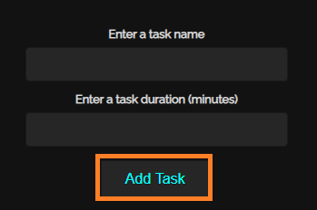
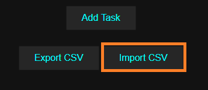
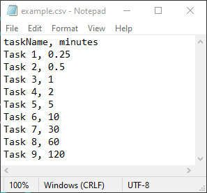
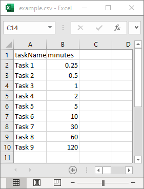
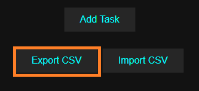

# TeamTime User Manual

## Running TeamTime

To run TeamTime, it is recommended that you open the project using Microsoft Visual Studio 2019 and run ‘countdownTimer.html’ 
using the latest version of your web browser via IIS Express.

## Interface Overview

 
 
The top left side of the interface highlighted in red is the main timer, the violet fill inside the circle reflects the amount of time completed for the current task. 
The large timer inside the circle represents the amount of time remaining for the current task. The small timer located the top of the circle represents the total amount
of time for all tasks. The small timer located at the bottom of the circle represents the amount of time remaining for all tasks.

The buttons highlighted in orange allow users to control the timer and can be used to play, pause, stop, and clear the timer.

The section highlighted in yellow allows users to enter a task name, along with the duration, and the ‘Add Task’ button can be used to add a task to the ‘Task List’.

The bottom left side of the interface highlighted in green allows users to import and export time configurations as CSV files.

On the right side of the interface is the task list, each added task can be found here. Each block in the list displays the name and duration of a task, as well as
its status, which can be either completed, active (running or paused) or incomplete. The task list will not be displayed until at least one task has been added.

## Adding Tasks
There are two ways to add tasks, via the ‘Add Task’ button and via  the ‘Import CSV’ button.

### Via Add Task Button
 

Simply a enter a task name that is at least 1 character in length and no longer than 25 characters in length. The duration for the task must be entered as minutes,
however valid decimal values are allowed (e.g. 0.5 minutes can be entered to represent 30 seconds). The duration value must be greater than 0 and less than 6000.

### Via Import CSV Button
 

The import CSV button allows users to bypass the ‘Add Task’ button and import time configurations via a CSV file. Simply click on the button, and you will be
directed to upload a CSV file from your device. All tasks specified in the CSV file will then be simultaneously added to the task list.

### Importing CSV Files
#### Using a Text Editor

  
Your CSV file MUST follow the exact format as demonstrated in the image above. 
* There MUST only be two columns in total.
* There MUST NOT be any blank lines until the end of the file.
* Each task name and duration MUST be separated by a comma.
* Each task name and duration MUST be valid.

### Using Microsoft Excel

If you are encountering any issues, it may be useful to edit and save the CSV file using Microsoft Excel to reduce the probability of user errors.

### Exporting CSV Files
 

All tasks in the task list can be exported to a CSV with a single click by clicking the ‘Export CSV’ button. It may be automatically downloaded to your default directory or you may be asked to specify a path for the file, depending on your browser and settings.
### Controlling the Timer
  
  
You can control the timer using the four buttons shown in the image above.

  
  
The play button allows you to start/resume the timer. There must be at least one incomplete task in the task list for this button to function.

  
  
The pause button allows you to pause the timer. The timer must be active for this button to function.

  
  
The stop buttons clears the timer and resets all tasks, marking them all as incomplete. 

  
  
The clear button functions as a hard reset for the entire application, it will clear the timer, and remove all tasks from the task list.

## Task List
### Overview

The task list will display each added task sequentially. For each task, on the far left is the task name, and on the far right is the duration and status of the task.

### Task Status Icons

The task is currently inactive and incomplete.

  
The task has been completed.

  
The Task is currently active and running.

   
The Task is currently active but paused.
